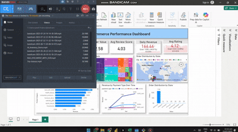

# 📦 E-Commerce Business Insights & Executive Dashboard

Analyze and visualize the Brazilian e-commerce market using real-world data. This project involves cleaning, merging, and analyzing datasets using Python, then building a compelling business dashboard with Power BI.

---

### 📊 Power BI Dashboard Preview



> 🎥 This animated GIF demonstrates the interactive Power BI dashboard built from the cleaned Olist e-commerce dataset. It includes insights into revenue, review scores, payment types, and customer distribution.

---

## 🚀 Project Overview

This project is based on Task 9 from the **Data Analytics Industry-Level Tasks**. It focuses on building end-to-end business intelligence from the **Brazilian E-Commerce Public Dataset by Olist** (available on Kaggle).

**Main Goals**:
- Create a unified master dataset
- Clean and preprocess customer, product, sales, payment, and review data
- Analyze metrics like revenue, reviews, orders, and product performance
- Build a professional dashboard in **Power BI**

---

## 📁 Dataset Source

- **Kaggle**: [Brazilian E-Commerce Public Dataset by Olist](https://www.kaggle.com/datasets/olistbr/brazilian-ecommerce)
- 100k+ orders, 30k+ products, 3k sellers, 1M+ geolocation records

**Files used**:
```
olist_customers_dataset.csv
olist_orders_dataset.csv
olist_order_items_dataset.csv
olist_products_dataset.csv
olist_order_reviews_dataset.csv
olist_order_payments_dataset.csv
olist_sellers_dataset.csv
olist_geolocation_dataset.csv
product_category_name_translation.csv
```

---

## 🧹 Data Cleaning & Merging (Python / Jupyter Notebook)

Cleaned and prepared using `pandas`:
- Merged 9 datasets into 1 master dataset with **119,000+ rows**
- Fixed nulls: filled or dropped based on impact
- Converted timestamp columns to proper datetime
- Created `total_price = price + freight_value`
- Handled data types, duplicates, outliers

✅ Final dataset: `master_ecommerce_dataset_final.csv`

---

## 📊 Power BI Dashboard

### 💡 KPIs
- Total Sales
- Total Orders
- Avg Order Value
- Avg Review Score
- Daily Revenue (vs Goal)
- Avg Rating (vs Goal)

### 📈 Charts & Visuals
- Orders vs Revenue Over Time (Line Chart)
- Revenue by Product Category (Bar Chart)
- Revenue by Payment Type Over Time (Line Chart)
- Order Distribution by Status (Bar Chart)
- Tree Map: Order Distribution by State
- Map: Geographic Distribution
- Payment Method Share (Pie Chart)
- Gauge Charts: Revenue & Rating Target

📌 **Interactive Filters**:
- Drill down into states, cities, order status, or year

---

## 📊 Key Insights

- Most used payment method: `Credit Card`
- Top product categories by revenue:
  - `bed_bath_table`
  - `health_beauty`
  - `computers_accessories`
- Review scores are generally high: Avg ≈ **4.12**
- Majority of orders are concentrated in state **SP**
- Revenue & Orders steadily grew over 3 years

---

## 🛠 Tools Used

- Python (Pandas, NumPy, Matplotlib)
- Power BI (Desktop)
- Excel (for quick checks)
- Jupyter Notebook

---

## 🔮 Possible Enhancements

- RFM Customer Segmentation
- Churn analysis
- Predictive sales forecasting
- Integration with real-time dashboards using Power BI Service

---

## 👤 Author

**Saad Tariq**  
🔗 [Portfolio Website](https://saadtariq10.github.io/PortfolioWebsite/)  
🔗 [LinkedIn](https://www.linkedin.com/in/saad-tariq-04328b254/)  
📬 saadtariq232@gmail.com

---

⭐ _If you found this helpful, please give the repo a star!_
